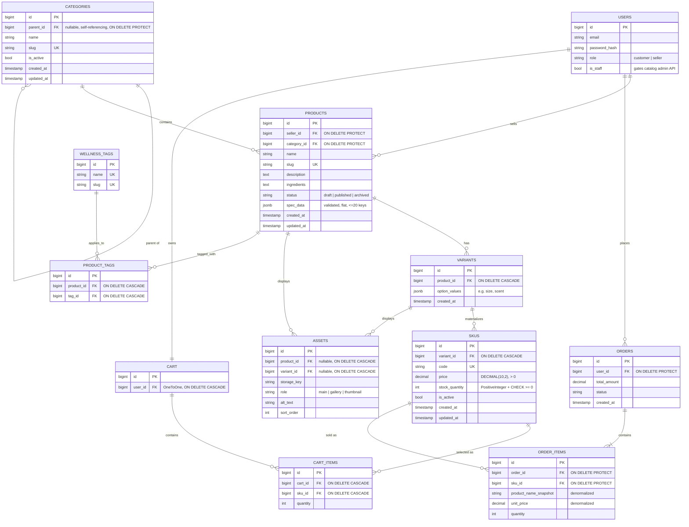

# Sprint 2: Catalog Data Foundation
**Project:** RootRemedy — An Online Storefront for Herbal & Wellness Products
**Course:** E-Commerce
**Sprint:** 2 — Architecture & Domain Modeling (15 days)

---

## 1. Sprint goal and scope boundary

**Goal:** given a product catalog administrator, the system persists
categories, products, variants, and SKUs without losing identity,
relationship, price, or inventory meaning.

**In scope:** category tree management; product creation/editing; variants
and SKUs with unique codes, price, stock, and availability; authenticated
administration for all four; constraints, migrations, seed data, and tests.

**Explicitly out of scope (deferred to Sprint 3):** dynamic per-category
specifications beyond the flat JSON field described in §3, asset upload
(the `Asset` table exists as schema only — see §8), public catalog search,
publication workflows beyond the single draft→published rule in §5, payment
integration, order placement, shipping, and the shopper-facing checkout
flow. `orders/models.py` contains `Cart`, `CartItem`, `Order`, and
`OrderItem` **only** as schema so the ERD in §3 can show a real connection
from the catalog to those Sprint 1 entities — no admin routes, views, or
business logic are implemented against them this sprint.

---

## 2. Link to Sprint 1 decisions this sprint reuses or changes

**Reused unchanged:** target audience and domain scope; React (Vite)
frontend; Django backend, chosen partly for its admin panel; PostgreSQL,
now justified even more directly by the new N:1 (`Product → Category`) and
N:1 (`SKU → Variant → Product`) relationships on top of the original N:M
`Product ↔ WellnessTag`; the `USERS.role` (`customer`/`seller`) field and
the `WELLNESS_TAGS` / `PRODUCT_TAGS` associative entity, both carried over
into `catalog/models.py` verbatim.

**Changed, with justification:**
- **Price and stock moved from `Product` to a new `SKU` table**, reached
  through `Product → Variant → SKU`. Sprint 1's flat `PRODUCTS` table
  assumed one price/stock pair per product, which the Sprint 2 brief's own
  requirement (`CAT03`: "one or more sellable SKUs, each with its own price
  and stock") makes incorrect the moment a product has more than one size
  or option. Moving price/stock down a level is a refinement of the MVP
  model, not a reversal of it.
- **A `Category` tree was added** alongside the existing `WellnessTag`
  system rather than replacing it. These answer different questions:
  `Category` is where a product structurally lives (used for admin
  navigation and, later, breadcrumbs); `WellnessTag` is the use-case filter
  Sprint 1 called out as the domain's core differentiator ("sleep",
  "digestion", "immunity"). A product now has exactly one category and zero
  or more tags — see §8, Q2.
- **A new `is_staff`-gated "catalog administrator" concept was introduced**,
  distinct from the existing `role` field. See §5.

---

## 3. Updated ERD and data dictionary



**Data dictionary — every FK's delete/update policy, in one place:**

| FK | On delete | Why |
|---|---|---|
| `Category.parent → Category` | `PROTECT` | Blocks accidental orphaning through hard delete; the supported lifecycle is `deactivate()` cascading soft-deletes (§8, Q3), not row deletion. |
| `Product.category → Category` | `PROTECT` | A category with products can't be hard-deleted; must be deactivated. |
| `Product.seller → User` | `PROTECT` | A seller account can't be hard-deleted out from under their catalog. |
| `Variant.product → Product` | `CASCADE` | Variants have no independent identity outside their product. |
| `SKU.variant → Variant` | `CASCADE` | Same reasoning, one level down. |
| `Asset.product/variant → …` | `CASCADE` | Media has no independent identity either. |
| `ProductTag.* → …` | `CASCADE` | Pure associative rows. |
| `CartItem.sku → SKU` | `CASCADE` | A cart is disposable; if a SKU is genuinely deleted, its cart rows should vanish, not block the delete. |
| `OrderItem.sku → SKU` | `PROTECT` | An order is a historical record; a SKU referenced by a placed order can only be deactivated, never deleted — see §8, Q7. |
| `Order.user → User` | `PROTECT` | Same historical-integrity reasoning. |

---

## 4. Administration route table, with examples

All routes below are implemented exactly as specified in the Sprint 2 brief,
under `/api/v1/admin/`, and require an authenticated `is_staff` account
(session or HTTP Basic auth via Django REST Framework). See §5 for why
`is_staff` rather than `role`.

| Method | Route | Purpose |
|---|---|---|
| `GET` | `/api/v1/admin/categories` | Return the category tree |
| `POST` | `/api/v1/admin/categories` | Create a category |
| `GET` | `/api/v1/admin/products` | Return administrative product records |
| `POST` | `/api/v1/admin/products` | Create a draft product |
| `PATCH` | `/api/v1/admin/products/:id` | Update product content or status |
| `POST` | `/api/v1/admin/products/:id/skus` | Add a validated SKU |
| `PATCH` | `/api/v1/admin/skus/:id` | Update price, stock, or active status |

A SKU technically belongs to a `Variant`, but the brief's route table has no
standalone `/variants` endpoint. `POST .../products/:id/skus` therefore
accepts **either** an existing `variant_id` on that product, **or** inline
`option_values`, in which case it reuses a matching existing variant or
creates a new one — implemented in `catalog/views.ProductSKUCreateView`.

### Example: create a category
```
POST /api/v1/admin/categories
Authorization: Basic <redacted>
Content-Type: application/json

{"name": "Herbal Teas", "slug": "herbal-teas", "parent": 1}
```
`201 Created`
```json
{"id": 2, "parent": 1, "name": "Herbal Teas", "slug": "herbal-teas",
 "is_active": true, "created_at": "2026-09-20T10:00:00Z", "updated_at": "2026-09-20T10:00:00Z"}
```

### Example: create a product (draft)
```
POST /api/v1/admin/products
{"seller": 3, "category": 2, "name": "Chamomile Dream Tea",
 "slug": "chamomile-dream-tea", "ingredients": "Chamomile, lavender"}
```
`201 Created` → `{"id": 7, "status": "draft", "variants": [], "has_active_sku": false, ...}`

### Example: add a SKU (new variant inline)
```
POST /api/v1/admin/products/7/skus
{"option_values": {"format": "20 tea bags"}, "code": "CHAM-BAG-20",
 "price": "9.99", "stock_quantity": 40}
```
`201 Created` → `{"id": 11, "code": "CHAM-BAG-20", "price": "9.99", "stock_quantity": 40, "is_active": true, "in_stock": true}`

### Example: duplicate slug (client error, not a traceback)
```
POST /api/v1/admin/categories
{"name": "Herbal Teas (again)", "slug": "herbal-teas"}
```
`400 Bad Request` → `{"slug": ["category with this slug already exists."]}`

### Example: publish without an active SKU (rejected)
```
PATCH /api/v1/admin/products/9
{"status": "published"}
```
`400 Bad Request` → `{"status": ["Cannot publish a product with no active SKU."]}`

### Example: unauthenticated write
```
POST /api/v1/admin/categories
{"name": "Oils", "slug": "oils"}
```
`401 Unauthorized` (no credentials) or `403 Forbidden` (authenticated but not staff)

---

## 5. Data integrity and authorization decisions

- **Uniqueness & FKs are enforced at the database layer**, not just in
  serializers: `Category.slug`, `Product.slug`, and `SKU.code` are
  DB-level `UNIQUE` columns (CAT02, part of CAT05); every FK above has an
  explicit `on_delete` policy (§3 table). DRF's serializer-level
  `UniqueValidator` (automatic for `unique=True` fields) is what turns most
  of these into a clean `400` before the database is even touched; a custom
  exception handler (`catalog/exceptions.py`) catches any `IntegrityError`
  that slips past that (e.g. a race between two concurrent requests) and
  still returns `400`, never a `500` traceback (CAT05, §6's error-handling
  requirement).
- **Stock non-negativity** is enforced twice: `PositiveIntegerField` at the
  Python/serializer layer, and a DB `CheckConstraint(stock_quantity__gte=0)`
  on `SKU` so it holds even for writes that bypass Django (a raw SQL script,
  a future service in another language).
- **Category cycle prevention** (CAT01) is enforced in `Category.clean()`,
  which walks the full ancestor chain — not just an immediate
  `parent == self` check — so a longer cycle (A→B→C→A) is caught too. A DB
  `CheckConstraint` additionally blocks the trivial one-hop case
  (`parent_id != id`) at the database layer.
- **Authorization (CAT06):** every administrative route uses a single
  `IsCatalogAdministrator` permission class requiring
  `request.user.is_authenticated and request.user.is_staff`.
  **Decision:** this sprint deliberately does *not* reuse Sprint 1's
  `role` field (`customer`/`seller`) for this gate. `role` answers "is this
  person a buyer or a seller on the marketplace," which Sprint 3 will use to
  scope a seller to editing only their own products (as Sprint 1's
  "Inventory Control" feature originally described). Sprint 2's
  administrator is a broader, catalog-wide role — closer to internal staff
  than to any one seller — so it uses Django's built-in `is_staff` flag
  instead. The two fields are independent by design so Sprint 3 can add
  per-seller scoping as an additional, narrower permission class without a
  migration touching auth.

---

## 6. Seed data and demonstration instructions

Run:
```bash
python manage.py migrate
python manage.py seed_catalog
```

This reproducibly creates (safe to re-run — uses `get_or_create`):
- **Two category levels**: `Wellness` → `Herbal Teas`, `Wellness` → `Tinctures`.
- **Three products**, one with multiple real variants: *Chamomile Dream Tea*
  (published, 1 variant/SKU), *Peppermint Ease Tea* (published, **2**
  variants/SKUs — 50g and 150g loose leaf), *Ginger Digestive Tincture*
  (draft, 1 variant/SKU).
- **Four valid SKUs**: `CHAM-BAG-20`, `PEP-LOOSE-50`, `PEP-LOOSE-150` (stock
  `0`, to also demonstrate the out-of-stock representation from §8, Q4),
  `GING-30ML`.
- **One intentionally missing combination**: a "tea bags" format for
  Peppermint Ease Tea is described in code comments as a plausible customer
  expectation, but no `Variant`/`SKU` row is created for it — demonstrating
  CAT04 directly (a missing combination is absent, not a fake zero-stock
  row).
- A `catalog_admin` / `demo-pass-123` staff account and a
  `herbalist_amina` seller account, for exercising the admin API by hand
  (e.g. with `curl -u catalog_admin:demo-pass-123 ...` against
  `/api/v1/admin/products`, after enabling `BasicAuthentication`, which is
  already in `REST_FRAMEWORK["DEFAULT_AUTHENTICATION_CLASSES"]`).

---

## 7. Test strategy, command, and result

**Strategy:** `catalog/tests/test_models.py` covers business rules at the
model layer (cycle prevention, publish-without-SKU rejection, duplicate
option-value rejection, DB-level uniqueness and stock constraints).
`catalog/tests/test_api.py` covers the same rules through the actual HTTP
API, plus authorization (CAT06): anonymous, authenticated-non-staff, and
staff requests against every write route.

**Command:**
```bash
python manage.py test
```

**Result:** this sandbox has no package-index access to install Django, so
the suite could not be executed inside this container — see the Known
Limitations note in §8 and in `README.md`. Run the command above after
`pip install -r requirements.txt` on a normal machine; paste the real
pass/fail output here before submission. The suite is written to fail loudly
(not silently pass) if a rule regresses: each rejection test asserts the
specific `400`/`401`/`403` status and, for model-layer tests, the specific
`ValidationError`/`IntegrityError`.

---

## 8. Business rules, edge cases, known limitations, and Sprint 3 backlog

**Q1 — Can a draft product have no SKU? Can a published product have no
sellable SKU?** A draft may have zero SKUs (`ProductPublishRuleTests.test_draft_product_can_have_zero_skus`).
A product cannot be *set* to `published` without at least one `is_active`
SKU — enforced in `Product.clean()` and mirrored in
`ProductAdminSerializer.validate()` for the API path.

**Q2 — One canonical category, many, or both?** One canonical category
(`Product.category`, required, `PROTECT`). Use-case discovery across
multiple facets still works through the separate `WellnessTag` M2M — a
product can carry several tags while living in exactly one place in the
category tree. This keeps "where is this administratively filed" and "what
is this useful for" as two different, non-conflicting questions.

**Q3 — What happens when a parent category is deactivated?**
`Category.deactivate()` sets `is_active=False` and recursively deactivates
every descendant. Hard delete is blocked entirely (`PROTECT`) — deactivation
is the only supported removal path, which is what makes the cascade safe to
automate.

**Q4 — How is an out-of-stock SKU represented in a public response?** Still
returned, not hidden: `SKU.to_public_dict()` / the `in_stock` property
return `in_stock: false` (both `is_active` and `stock_quantity > 0` must
hold to be `true`) rather than omitting the SKU.

**Q5 — Can two SKUs share a price? Can a SKU have a price override?** Yes,
freely (`SKUTests.test_two_skus_can_share_a_price`). There is no separate
base price anywhere above SKU to "override" — price lives only at the SKU
level, so the override question doesn't arise by construction.

**Q6 — What prevents negative stock and duplicate SKU codes?** `stock_quantity`
is a `PositiveIntegerField` plus a DB `CheckConstraint`; `code` is
`unique=True` at the DB layer, backed by DRF's `UniqueValidator` for a clean
`400` response.

**Q7 — What happens to a product referenced by a future cart or order after
it is deactivated?** `CartItem.sku` is `CASCADE` (a cart is disposable);
`OrderItem.sku` is `PROTECT` and `OrderItem` denormalizes
`product_name_snapshot` and `unit_price` at creation time, so a historical
order stays accurate even after the live SKU is deactivated or its price
changes later.

**Known limitations of this submission:**
- Migrations were hand-written rather than generated by `makemigrations`,
  because this sandbox has no network access to install Django. Run
  `manage.py makemigrations --check` on a real machine before relying on
  them (see README.md).
- §7's actual pass/fail test output is a placeholder pending that same
  install step.
- `Asset` exists only as a schema/migration; no upload endpoint, storage
  backend, or tests back it yet.
- `spec_data` validation is intentionally shallow (flat dict, ≤20 keys,
  scalar values only) — no per-category schema yet.

**Sprint 3 backlog (hand-off):** dynamic per-category specifications, asset
upload + storage backend, public (unauthenticated) catalog reads and
search, a real publication workflow beyond the single draft→published
check here, per-seller scoping of the admin API using `User.role` alongside
`is_staff`, and catalog-to-cart readiness (wiring the existing
`orders` schema stubs up to real cart/checkout logic).
