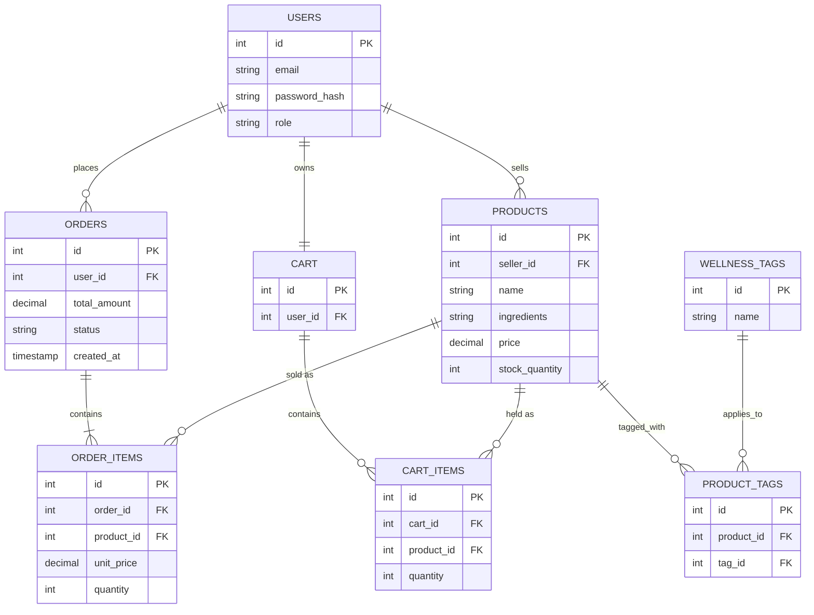

# Sprint 1: System Architecture & Scope Definition
**Project:** RootRemedy — An Online Storefront for Herbal & Wellness Products
**Course:** E-Commerce
**Sprint:** 1 — Architecture & Domain Modeling

---

## Section 1: Target Audience & Market Focus

**Primary Persona:**
Small herbal apothecaries and independent wellness producers (herbal teas, tinctures, dried herbs, salves) who currently sell at farmers markets or through basic social media posts, and health-conscious consumers looking to browse products by the specific ailment or wellness goal they address (e.g., sleep, digestion, immunity).

**Core Pain Point:**
Herbal product sellers need to communicate detailed, product-specific information (ingredients, sourcing, usage/dosage suggestions) that generic e-commerce templates don't surface well, and buyers want to filter products by intended use rather than just a generic category name.

**Domain Scope:**
Vertical marketplace for **herbal and wellness products**, part of the Health & Wellness Consumer Goods vertical, distinguished by ingredient-level detail and use-case-based (rather than purely category-based) discovery.

---

## Section 2: MVP Feature Scope

| Category | Feature Name | Description | Priority |
|---|---|---|---|
| Authentication | User Registration & Authentication | Password hashing and JWT-based auth, with a `role` field separating `customer` and `seller` accounts. | High (MVP) |
| Catalog | Product Listing & Use-Case Filter | Sellers list products with ingredients and a linked set of "wellness tags" (e.g., Sleep, Immunity, Digestion). Customers browse and filter by tag as well as by category. | High (MVP) |
| Cart | Cart Management | Persistent cart across multiple sellers; add/update/remove line items. | High (MVP) |
| Checkout | Order Processing | Stripe (test mode) integration; creates an `Order` and `Order_Items`, decrements product stock on success. | High (MVP) |
| Seller Tools | Inventory Control | CRUD interface scoped to the authenticated seller's own products, including editing ingredient lists and wellness tags. | Medium |

**Feasibility note:** The one domain-specific addition beyond a standard catalog/cart/checkout flow is the many-to-many "wellness tags" relationship — everything else follows a conventional e-commerce shape, keeping the sprint scope realistic.

---

## Section 3: Tech Stack Selection & Justification

**Frontend Framework: React (Vite)**
Justification: A straightforward product-browsing and filtering UI doesn't require SSR/SEO investment beyond what a normal single-page app provides at this stage, so a lighter Vite + React setup keeps initial build time low for the team.

**Backend Infrastructure: Django**
Justification: Django's built-in admin panel is a strong fit here, since sellers primarily need structured forms for entering ingredients and tags rather than a highly custom UI — the admin interface can double as an internal management tool during development, chosen over a leaner framework like FastAPI specifically for that built-in tooling.

**Database Management System: PostgreSQL**
Justification: The many-to-many relationship between products and wellness tags is a natural fit for a relational join table, and PostgreSQL's constraint support keeps stock decrements and order totals consistent — preferred over a document database where the tag relationship would need denormalized duplication.

**Caching & Asynchronous Processing (Optional): Not included in MVP**
Justification: No scheduled or background jobs are required for this feature set; left out of scope to keep Sprint 1 focused, with Redis-backed session caching as a candidate addition only if traffic later warrants it.

---

## Section 4: Entity-Relationship Diagram (ERD)

### Cardinality Summary
- **USERS 1 : N PRODUCTS** — one seller manages many products.
- **USERS 1 : N ORDERS** — one customer places many orders.
- **PRODUCTS N : M WELLNESS_TAGS** — resolved via the `PRODUCT_TAGS` associative entity, since a product can address multiple wellness goals and a tag applies to many products.
- **ORDERS 1 : N ORDER_ITEMS**; **PRODUCTS 1 : N ORDER_ITEMS**, **1 : N CART_ITEMS**.
- **USERS 1 : 1 CART**, **CART 1 : N CART_ITEMS**.

